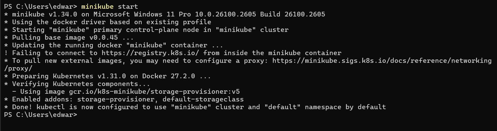
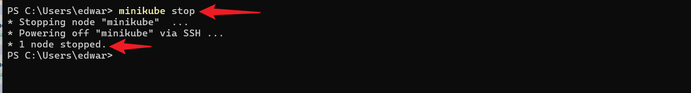
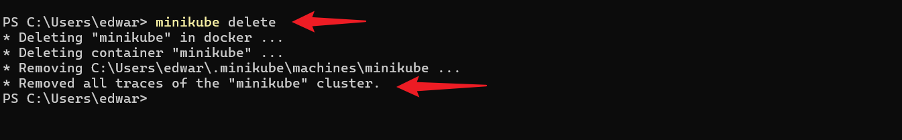
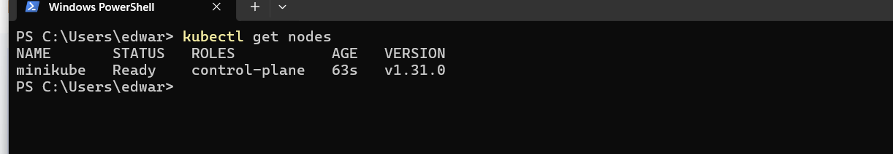
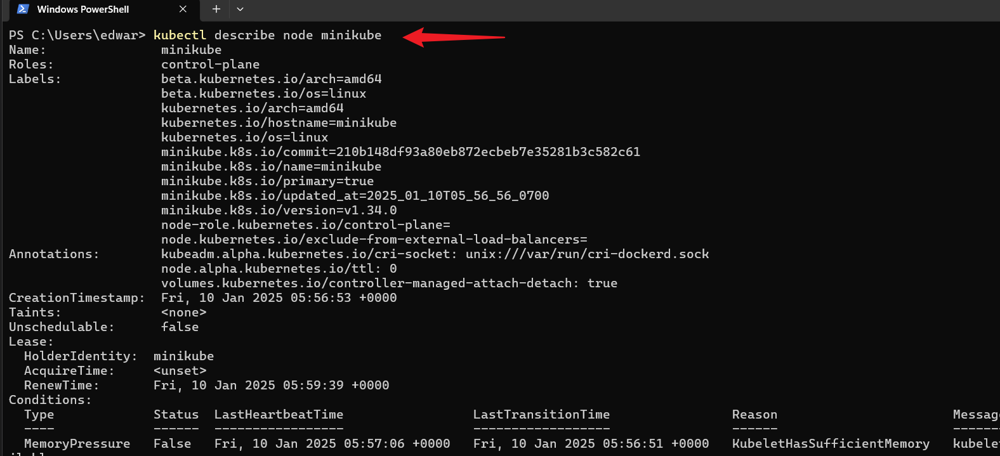

# Working With Kubernetes Node

### What Is a Node

In kubernetes, think of a node as a dedicated worker, like a dependable employee in an office, responsible for executing tasks and hosting containers to ensure seamless application performance.Kubernetes Nodes are the worker machines in a Kubernetes cluster. Each node runs containerized applications and provides essential components

**kubelet**: Manages the containers.

**Container** Runtime (e.g., Docker): Runs the containers.

**kube-proxy**: Handles networking for the containers.

Nodes ensure your applications run smoothly by managing the workloads and maintaining the desired state as defined by the Kubernetes control plane.

### Managing Nodes In Kubernetes

  Minikube simplifies the management of kubernetes for development and testing purposes.But in the context of minikube (a kubernetes cluster), we need to start it up before we can be abe to access our cluster.

  1 Start Minikube cluster

    minikube start

   

   This command starts a local kubernetes cluster (minikube) using a single node minikube set-up.It provisions a virtual machine(VM) as a kubernetes node.

 2 Stop Minikube Cluster

    minikube stop
  
  

   Stops the running Minikube (Local Kubernetes Cluster), preserving the cluster state.

 3 Delete Minikube Cluster

    minikube delete

 

  Deletes the Minikube kubernetes cluster and its associated resources.

  
 4 View Nodes

    kubectl get nodes
 
  
  List all nodes in the kubernetes cluster along with their current status.

  

 5 Inspect a Node

     kubectl describe node <node-name>

   Provide detailed information about a specific node, including its capacity, allocated resources, and status.

 
 ### Node Scaling and Maintenance

 Minikube, as its often used for local development and testing, scaling nodes may not be as critical as in production environments. However,understanding the concept is critical.

 * **Node Scaling** Minikube is typically a single-node cluster, meaning you have one worker node.

 * **Node Upgrade** Minikube allows you to easily upgrade your local cluster to a new kubernetes version, ensuring that your development environment aligns with the target production environment.

 By effectively managing nodes in Minikube kubernetes cluster, we can create, test and deploy applications locally, silmulating a kubernetes cluster without the need for a full-scale production set-up. This is particularly useful for debugging, experimenting and developing application in a controlled environment.